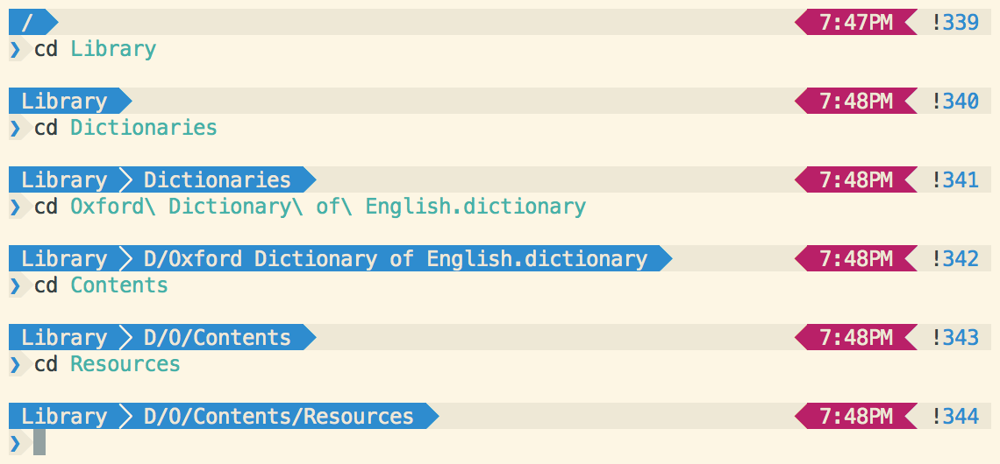

Statusline
===========


### A Powerline-style prompt for [prezto](#prezto) and [oh-my-zsh](#oh-my-zsh)
Wish your prompt displayed more information, but afraid of filling it with clutter? Statusline is a responsive zsh theme that provides informational segments when you need them. For example, statusline only displays your user and machine names when you are in a remote shell. Likewise, task runtimes are only shown when they exceed ten seconds, the current working directory is dynamically shortened to fit onscreen, and more! Statusline is designed for solarized (light and dark), and is compatible with the default OS X Terminal.app.

### Prerequisites
(The [prezto version's installer](prezto/) checks for and installs all prerequisites)
- [Powerline-patched menlo font](setup/MenloforPowerline-Regular.otf) (optional, see `--font` option)
- [Solarized light](setup/Solarized\ Light.terminal) or [solarized dark](setup/Solarized\ Dark.terminal) Terminal.app profiles
- zsh `5.0.0+` and git `2.0.0+`

### Quick Install
Got/want prezto? Statusline is one line away:
```zsh
zsh -c "$(curl -fsSL https://raw.githubusercontent.com/el1t/statusline/master/prezto/install)"
```
For more information, read on!

## Features
- **Asynchronous** git status loading
- Task **runtime**
- **Light** and **dark** themes
- **Contextual** segments
- Fully **modular** design
- Custom `PS1`, `RPS1`, `PS2`, `RPS2`, `PS3`, `PS4`, `SPROMPT`, and completion formatting
- **Dual-** and **single-line** prompts
- **Powerline** and **legacy font** support
- Tmux compatible

### Single line mode
In addition to a two-line prompt, statusline supports a [single-line mode](#options)


### Segments
| Name       | Description               | Context                      |
| ---------- | ------------------------- | ---------------------------- |
| status     | SU/exit code/running jobs | when statuses are present    |
| user       | username                  | when in a remote shell       |
| machine    | machine name              | when in a remote shell       |
| git-branch | branch/position/commit    | when inside a git repository |
| git-status | stashed/behind/ahead/etc. | when inside a git repository |
| directory  | current working directory | dynamically truncated        |
| time       | 12-hour clock             | always                       |
| history    | index in zsh history      | always                       |

#### Directory truncation?
When the length of the working directory exceeds that of the terminal, subdirectories up to (but not including) the tail directory are shortened to their first letter. In order to use this, **directory must be last in the left-hand prompt**. Note that only the minimum number of directories necessary are shortened.


## [Prezto](prezto/)
### Installation
For automatic installation, simply run this in your shell:
```zsh
zsh -c "$(curl -fsSL https://raw.githubusercontent.com/el1t/statusline/master/prezto/install)"
```
[Manual installation](prezto/README.md)

### Updating
Run this to update prezto and all its submodules (including statusline):
```sh
git -C ~/.zprezto submodule foreach git pull origin master && git -C ~/.zprezto submodule foreach "(git checkout master; git pull)&"
```

## Options
Set options in `zshrc` with `zstyle ':prezto:module:prompt' theme 'statusline' <options>`

| Option       | Parameters          | Description                    |
| ------------ | ------------------- | ------------------------------ |
| -c, --color  | Terminal color code | Set statusbar background color |
| -d, --dark   | N/A                 | Apply dark theme               |
| -f, --font   | See below           | Change special chars used      |
| -s, --single | N/A                 | Fit the prompt to one line     |

| Font Parameter | Characters |
| -------------- | :--------: |
| powerline      |  ⮂   ⮀   |
| legacy         |  ◀ < > ▶︎   |
| block          |  ◼ \| \| ◼   |
| none           |     N/A    |
Run `prompt -h statusline` for more information.

## [Oh-my-zsh](oh-my-zsh/)
Since the [prezto version](#prezto) uses certain prezto modules which are not present in oh-my-zsh, missing features were ported to the [oh-my-zsh version](oh-my-zsh/statusline.zsh-theme). This includes asynchronous git status loading, which was ported from prezto's git-info, and the customizable settings. However, statusline's settings are not exposed by oh-my-zsh, so customization is more difficult. Also, the key-binding color indicator is currently not supported in this version.
